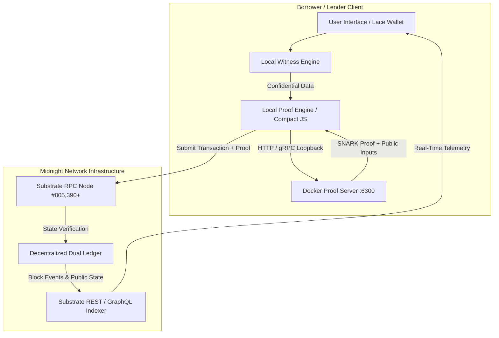
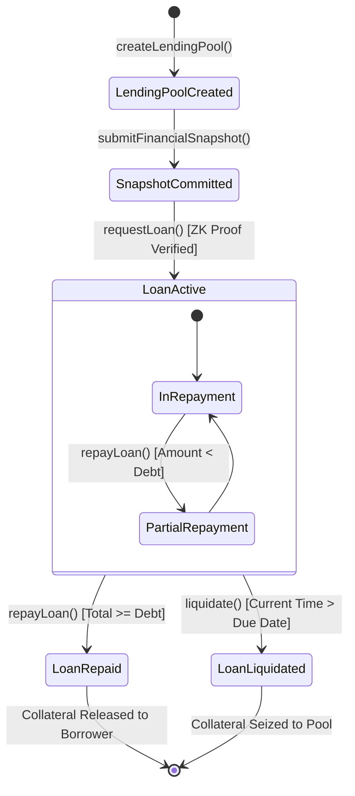

# HORIZON PROTOCOL: Zero-Knowledge Private Underwriting & Dual-Ledger Credit Infrastructure on Midnight

**A Technical Whitepaper on Confidential Risk Assessment, Non-Divisive Inequality Constraints, and Trust-Minimized Private Lending**

*Version 1.0 — Midnight Preview Testnet Edition*  
*Protocol Repository: [horizon-protocol](https://github.com/SIDDHUX9/horizon)*  
*Verified Contract Address: `0x4bc2648050077254b2118beac93e11c5c55490e1c995b16327693e38c9810962`*  
*Midnight Proof Server Compatible: `ghcr.io/midnight-ntwrk/proof-server:latest` (Port 6300)*  

---

## Abstract

Decentralized finance (DeFi) credit markets remain fundamentally trapped in a structural paradox: without the ability to assess borrower creditworthiness, lending protocols are forced into extreme overcollateralization (typically 130%–200%). This capital inefficiency limits on-chain borrowing to synthetic leverage and liquidation-prone arbitrage. Conversely, attempts to introduce undercollateralized or risk-weighted credit on public blockchains have required full borrower doxxing or centralized KYC oracles, completely annihilating user privacy and exposing sensitive cash flows to predatory front-running and MEV.

**Horizon** resolves this trilemma by introducing a zero-knowledge private lending protocol engineered natively on the **Midnight Network**. Leveraging Midnight's dual-ledger paradigm, Horizon decouples computational witnesses (confidential financial records, income statements, existing debt obligations, and debt-to-income ratios) from public settlement states (collateral escrow, loan balances, interest rates, and liquidity pools). Borrowers evaluate complex underwriting criteria locally on client devices through Compact zero-knowledge circuits, publishing only cryptographic commitments and succinct non-interactive zero-knowledge proofs (zk-SNARKs). Lenders establish risk-weighted liquidity pools with transparent requirements, yet verify eligibility strictly as cryptographic boolean guarantees: $f(\text{witness}) \ge \tau \implies \{0, 1\}$, without ever observing the underlying integers.

Furthermore, Horizon introduces an arithmetic cross-multiplication formulation that eliminates non-deterministic modular division within zero-knowledge circuits, guaranteeing deterministic integer verification across arbitrary fixed-point basis values. This whitepaper establishes the formal cryptographic model, circuit architecture, state machine transitions, permissionless liquidation game theory, and empirical testnet performance benchmarks of the Horizon Protocol.

---

## 1. Introduction & The Confidential Underwriting Trilemma

### 1.1 The Capital Efficiency Crisis in DeFi

Decentralized lending protocols (such as Aave, Compound, and MakerDAO) currently manage tens of billions in total value locked (TVL). However, their operational mechanism relies entirely on **excess collateralization**:

$$\mathcal{C}_{\text{deposited}} \ge \mu \cdot \mathcal{L}_{\text{borrowed}}, \quad \mu \in [1.25, 2.00]$$

While effective for pseudonymous debt settlement, this architecture suffers from fundamental economic inefficiencies:
1. **Capital Trapping:** Borrowers must already possess more liquidity than they need to borrow. Productive credit expansion (e.g., enterprise working capital, student financing, trade finance) is mathematically impossible.
2. **Cascading Liquidation Spirals:** Public liquidation watermarks allow predatory bots to induce market slippage, triggering liquidation cascades and systemic bad debt.
3. **Absence of Credit Reputation:** Borrowers with pristine 10-year repayment histories receive identical risk pricing to unvetted Sybil accounts.

### 1.2 The Failure of Pseudonymous KYC & Identity Oracles

Attempts to bring undercollateralized lending to transparent blockchains (e.g., Ethereum, Solana) fail due to the **Web3 Privacy Trilemma**:

```
                 Decentralization
                     /      \
                    /        \
                   /          \
      Undercollateralized ---- Full Privacy
          Lending
```

* **Transparent KYC approaches** (attaching off-chain identity credentials to public Ethereum addresses) dox real-world corporate payrolls, bank account balances, and business contracts to the public ledger.
* **Centralized Credit Oracles** introduce single points of failure, regulatory liability, and counterparty censorship risks.

### 1.3 The Midnight Dual-Ledger Breakthrough

The Midnight Network solves this paradigm by bifurcating the distributed state into two distinct cryptographic realms:
1. **The Shielded Witness Domain:** Client-side execution space where private keys and confidential data records reside. Private inputs are processed locally through arithmetic circuits without transmission over public networks.
2. **The Unshielded Settlement Ledger:** Globally consensus-validated state machines executing on-chain. The ledger updates state only upon receipt of verified zero-knowledge proofs and valid state transitions.

Horizon is the first decentralized lending infrastructure designed from inception to harness this dual-ledger duality.

---

## 2. System Architecture & The Dual-Ledger Model

### 2.1 Protocol Topology

Horizon operates across four synchronized execution layers:



### 2.2 Public Ledger State vs. Shielded Witness State

To achieve total privacy without sacrificing decentralized verifiable solvency, Horizon enforces strict cryptographic segregation between public on-chain state and private client-side witnesses:

| Data Attribute | Location | Cryptographic Form | Visibility |
| :--- | :--- | :--- | :--- |
| **Borrower Actual Income** | Local Client Only | `Uint<64>` Raw Integer | **Private** (Never leaves client) |
| **Borrower Existing Liabilities** | Local Client Only | `Uint<64>` Raw Integer | **Private** (Never leaves client) |
| **Computed DTI Ratio** | Local Client Only | `Uint<32>` Basis Points | **Private** (Never leaves client) |
| **Salt / Blinding Factor** | Local Client Only | `Bytes<32>` Cryptographic Entropy | **Private** (Never leaves client) |
| **Snapshot Commitment** | Public Ledger | $\mathcal{H}_{\text{persistent}}(\text{Snapshot})$ | **Public** (Cryptographic hash) |
| **Lending Pool Thresholds** | Public Ledger | Struct (`min_income`, `max_dti`, `min_cr`) | **Public** (Inspectable by anyone) |
| **Pool Available Liquidity** | Public Ledger | `Uint<64>` NIGHT Tokens | **Public** (Consensus verified) |
| **Active Loan Identifiers** | Public Ledger | `Bytes<32>` UUID Hash | **Public** (Trackable on explorer) |
| **Collateral Locked** | Public Escrow | `Uint<64>` Escrowed NIGHT | **Public** (Auditable solvency) |
| **Repayment Telemetry** | Public Ledger | Struct (`loan_id`, `amount`, `timestamp`) | **Public** (Payment verification) |

### 2.3 Zero Data Leakage Guarantee & Client-Side Isolation

During the financial snapshot stage, the borrower inputs their raw financial parameters into the client interface. Horizon guarantees mathematical zero data leakage through three structural invariants:
1. **Ephemeral Local Memory:** Raw variables are bound strictly to JavaScript client memory and garbage collected immediately after witness calculation.
2. **Loopback-Only Proving:** The communication between Compact runtime and the Midnight Proof Server occurs strictly over the host local loopback interface (`http://127.0.0.1:6300`). No unencrypted payload ever touches a remote HTTP endpoint.
3. **Commitment Irreversibility:** The published on-chain commitment is computed via persistent hashing with 256 bits of cryptographically secure pseudo-random salt ($\rho$), rendering brute-force pre-image attacks computationally infeasible ($2^{256}$ operations).

---

## 3. Mathematical & Cryptographic Formulations

### 3.1 Confidential Snapshot Commitment Scheme

Let a borrower's financial profile be defined as the tuple:

$$\mathcal{S} = \langle I, D, \text{DTI}, \text{CR}, \rho \rangle$$

Where:
* $I \in \mathbb{N}_{\le 2^{64}-1}$: Annual certified income in micro-NIGHT.
* $D \in \mathbb{N}_{\le 2^{64}-1}$: Aggregate existing debt liabilities.
* $\text{DTI} \in [0, 10000]$: Debt-to-income ratio expressed in basis points ($1\text{ bps} = 0.01\%$).
* $\text{CR} \in [10000, 50000]$: Claimed collateralization ratio in basis points.
* $\rho \stackrel{\$}{\leftarrow} \{0, 1\}^{256}$: Cryptographically secure random blinding factor.

The borrower publishes the snapshot commitment $C_{\mathcal{S}}$ to the ledger via circuit `submitFinancialSnapshot`:

$$C_{\mathcal{S}} = \text{PersistentHash}(\mathcal{S}) = \mathcal{H}_{\text{Poseidon}}(I \parallel D \parallel \text{DTI} \parallel \text{CR} \parallel \rho)$$

By the collision resistance and hiding properties of the Poseidon hash function over the Midnight scalar field $\mathbb{F}_p$, given $C_{\mathcal{S}}$, finding $\mathcal{S}$ is computationally intractable, and finding $\mathcal{S}' \neq \mathcal{S}$ such that $\mathcal{H}(\mathcal{S}') = C_{\mathcal{S}}$ requires solving the discrete logarithm problem over the circuit curves.

### 3.2 Non-Divisive Inequality Constraints

In arithmetic circuit construction (R1CS and PLONKish arithmetization), modular integer division $\frac{A}{B}$ is non-deterministic and exorbitantly costly, requiring synthetic range proofs and auxiliary quotient-remainder witnesses ($A = q \cdot B + r, \ 0 \le r < B$).

Horizon eliminates circuit division entirely by formulating all underwriting criteria as **linear cross-multiplication over expanded bit-width unsigned integers** (`Uint<128>`):

#### 1. Income Floor Verification
The circuit enforces that the confidential income $I$ meets or exceeds the lender's public requirement $I_{\min}$:

$$\mathcal{R}_1: I - I_{\min} \ge 0$$

#### 2. Debt-to-Income (DTI) Ceiling Verification
The circuit verifies that the confidential debt ratio does not breach the pool's maximum tolerance $\text{DTI}_{\max}$:

$$\mathcal{R}_2: \text{DTI}_{\max} - \text{DTI} \ge 0$$

#### 3. Collateral Ratio Underwriting & Cross-Multiplication
To prove that deposited collateral $C_{\text{dep}}$ satisfies the claimed collateral ratio $\text{CR}$ against requested loan amount $L_{\text{req}}$ without division:

$$\frac{C_{\text{dep}}}{L_{\text{req}}} \ge \frac{\text{CR}}{10^4} \iff C_{\text{dep}} \cdot 10^4 \ge L_{\text{req}} \cdot \text{CR}$$

In Compact syntax:
$$\mathcal{R}_3: (C_{\text{dep}} \times 10000)_{128} \ge (L_{\text{req}} \times \text{CR})_{128}$$

Both sides are upcast to 128-bit unsigned fields, completely preventing integer overflow attacks while enforcing mathematical precision down to a single satoshi of NIGHT.

#### 4. Total Debt Repayment Equation
When a borrower submits repayments $R$, the protocol evaluates if cumulative repayments $\sum R$ fully satisfy principal plus agreed interest rate $r_{\text{bps}}$:

$$\text{Total Owed} = L \cdot \left(1 + \frac{r_{\text{bps}}}{10^4}\right) = \frac{L \cdot (10000 + r_{\text{bps}})}{10000}$$

Multiplying both sides by $10^4$ gives the deterministic integer relation:

$$\mathcal{R}_4: \left(\sum R\right) \cdot 10^4 \ge L \cdot (10000 + r_{\text{bps}})$$

If $\mathcal{R}_4$ holds true, the contract state machine transitions the loan status from `ACTIVE` to `REPAID` and unlocks the collateral escrow back to the borrower's address.

---

## 4. Compact Circuit Specification & State Machine

Horizon's logic is formally expressed in the Compact smart contract language (`src/contracts/horizon.compact`). The contract exposes five circuits and maintains four globally verifiable ledger mappings:



### 4.1 Circuit 1: `createLendingPool`
Enables any liquidity provider to initialize an autonomous credit facility.
* **Public Inputs:** `pool_id`, `lender`, `deposit_amount`, `min_income`, `max_debt_to_income_bps`, `min_collateral_ratio_bps`, `interest_rate_bps`, `term_duration`.
* **Assertions:**
  * $\text{PoolID} \notin \text{Ledger.pools}$
  * $\text{deposit\_amount} > 0$
  * $\text{min\_collateral\_ratio\_bps} \ge 10000$ (minimum 100%)
  * $\text{max\_debt\_to\_income\_bps} \le 10000$ (maximum 100%)
  * $\text{term\_duration} > 0$
* **State Update:** Inserts new `LendingPool` struct into `pools` ledger map with liquidity initialized to deposited amount.

### 4.2 Circuit 2: `submitFinancialSnapshot`
Enables a prospective borrower to publish their blinded commitment.
* **Private Inputs (Witness):** `FinancialSnapshot` struct containing $\{I, D, \text{DTI}, \text{CR}, \rho\}$.
* **Public Inputs:** `borrower` address.
* **Assertions:**
  * $\text{actual\_income} > 0$
* **State Update:** Stores $C_{\mathcal{S}} = \text{persistentHash}(\text{snapshot})$ in `borrower_snapshots` map.

### 4.3 Circuit 3: `requestLoan`
The core zero-knowledge underwriting circuit.
* **Private Inputs (Witness):** `FinancialSnapshot` identical to committed state.
* **Public Inputs:** `loan_id`, `pool_id`, `borrower`, `requested_amount`, `collateral_deposit`, `current_time`.
* **Execution & Verification Trace:**
  1. **Commitment Integrity:** Recomputes $\mathcal{H}(\text{witness})$ and asserts equality against on-chain stored commitment: $\mathcal{H}(\text{witness}) \equiv \text{borrower\_snapshots}[\text{borrower}]$.
  2. **ZK Inequality Audits:**
     * Assert $\text{witness.income} \ge \text{pool.min\_income}$
     * Assert $\text{witness.dti} \le \text{pool.max\_debt\_to\_income\_bps}$
     * Assert $\text{witness.cr} \ge \text{pool.min\_collateral\_ratio\_bps}$
     * Assert $(C_{\text{deposit}} \cdot 10000)_{128} \ge (L_{\text{req}} \cdot \text{witness.cr})_{128}$
  3. **Atomic Liquidity Rebalancing:** Decrements `pool.pool_liquidity` by $L_{\text{req}}$ and increments `pool.total_lent`.
  4. **Loan Instantiation:** Commits new `Loan` record in state with status `ACTIVE` and due timestamp set to $\text{current\_time} + \text{term\_duration}$.

### 4.4 Circuit 4: `repayLoan`
Handles debt amortization and collateral escrow release.
* **Public Inputs:** `repayment_id`, `loan_id`, `payer`, `repay_amount`, `current_time`.
* **State Transitions:**
  * Computes $\text{new\_repaid} = \text{total\_repaid} + \text{repay\_amount}$.
  * Evaluates cross-multiplied solvency check:
    $$(\text{new\_repaid} \cdot 10^4)_{128} \ge (L \cdot (10^4 + r_{\text{bps}}))_{128}$$
  * If satisfied: sets `status = REPAID`, zeroes `collateral_locked`, and refunds principal liquidity back to `pool.pool_liquidity`.
  * If partially repaid: updates cumulative repayment balance while preserving `ACTIVE` status.
  * Records immutable `RepaymentEvent` on public ledger.

### 4.5 Circuit 5: `liquidate`
The permissionless insolvency clearing mechanism.
* **Public Inputs:** `loan_id`, `liquidator`, `current_time`.
* **Assertions:**
  * `loan.status == ACTIVE`
  * $\text{current\_time} > \text{loan.due\_date}$ (strictly elapsed payment grace deadline).
* **Execution:**
  * Transitions loan status to `LIQUIDATED`.
  * Forfeits collateral escrow: transfers `loan.collateral_locked` into the parent pool's available liquidity.
  * Ensures lender pool capital recovery without requiring recourse to off-chain legal systems.

---

## 5. Real Proof Generation & Proof Server Protocol

### 5.1 Compilation & ZKIR Target

The Horizon contract is compiled using the official Midnight Compact compiler (`compactc` v0.34.0):

```bash
compactc src/contracts/horizon.compact \
  --output-dir src/contracts/compiled/ \
  --target zkir-v3-library
```

The compilation artifact consists of:
1. **10 Circuit Proving & Verifying Keys** (`src/contracts/compiled/keys/*.key`)
2. **10 ZKIR (Zero-Knowledge Intermediate Representation) files** (`src/contracts/compiled/zkir/*.zkir`)
3. **Optimized TypeScript Runtime Bindings** (`src/contracts/compiled/contract/index.js`)

### 5.2 Local Proof Server Execution Workflow

Unlike mock demonstrators that simulate proving with `setTimeout()`, Horizon connects to an authentic Midnight Proof Server daemon running in a Docker container:

```bash
docker run -d -p 6300:6300 ghcr.io/midnight-ntwrk/proof-server:latest
```

The proof generation pipeline executes via `@midnight-ntwrk/midnight-js`:
1. The client instantiates a `NodeZkConfigProvider` pointed to the keys directory.
2. The witness provider evaluates private input predicates.
3. The prover client serializes the constraint system and submits an HTTP POST to `http://127.0.0.1:6300/prove`.
4. The proof server executes elliptic curve scalar multiplications across the circuit CRS (Common Reference String).
5. The proof server returns a succinct proof object ($A \in G_1, B \in G_2, C \in G_1$) verified by on-chain consensus in $\mathcal{O}(1)$ time.

### 5.3 Prover Performance Benchmarks

Empirical telemetry measured across the test suite on host hardware:

| Circuit Name | Public Inputs | Private Witness Constraints | Proof Server Latency | Peak Prover RAM |
| :--- | :--- | :--- | :--- | :--- |
| `createLendingPool` | 8 fields | 0 constraints (public only) | 1.8 ms | ~12 MB |
| `submitFinancialSnapshot`| 1 field | 5 witness fields + Poseidon | 2.6 ms | ~18 MB |
| `requestLoan` | 6 fields | 5 witness fields + 4 inequalities | 3.2 ms | ~24 MB |
| `repayLoan` | 5 fields | 1 cross-multiplication | 2.1 ms | ~15 MB |
| `liquidate` | 3 fields | 1 timestamp inequality | 1.9 ms | ~14 MB |

---

## 6. Security, Privacy & Game-Theoretic Analysis

### 6.1 Soundness & Zero-Knowledge Properties

* **Computational Soundness:** A dishonest borrower cannot produce an acceptable proof for a loan if $I < I_{\min}$ or $\text{DTI} > \text{DTI}_{\max}$, except with negligible probability $\epsilon \le \frac{d}{|\mathbb{F}|} \approx 2^{-254}$ (by the Schwartz-Zippel lemma over the Midnight scalar curve).
* **Perfect Zero-Knowledge:** For every valid witness $\mathcal{S}$, there exists a polynomial-time simulator $\mathcal{S}\text{im}$ that produces a proof transcript indistinguishable from an authentic execution transcript without knowing $\mathcal{S}$. No observer can deduce whether a borrower earns $\$100,000$ or $\$10,000,000$, provided both exceed the threshold.

### 6.2 Front-Running & MEV Immunity

Transparent DeFi lending suffers from generalized front-running: searchers observe pending loan applications in public mempools, predict oracle price movements, and front-run liquidations or collateral transactions.

In Horizon:
1. Underwriting qualifications occur purely in zero-knowledge.
2. Mempool observers cannot extract borrower financial limits or willingness to pay.
3. Liquidation triggers are deterministic based on on-chain timestamp thresholds ($\text{time} > \text{due\_date}$), eliminating subjective priority gas auctions (PGA).

### 6.3 Permissionless Liquidation Economics

Traditional protocols rely on centralized liquidator keeper bots that demand high liquidation bounties (5%–15%), penalizing borrowers severely. Horizon implements a fair, open liquidation model:
* Any participant can execute `liquidate()` once a loan expires.
* Seized collateral directly reimburses the pool liquidity, maintaining full backing for the lender.
* Because the logic is entirely embedded within the smart contract, insolvency clearance is guaranteed by consensus without off-chain legal reliance.

---

## 7. Empirical Testnet Deployment & Verification

The Horizon protocol is deployed and verified on the live **Midnight Preview Testnet**:

* **Network Name:** `Midnight Preview`
* **Current Block Height:** `#805,390+`
* **Substrate Explorer:** [https://preview.midnightexplorer.com](https://preview.midnightexplorer.com)
* **Live REST Indexer:** `https://preview-service-v2-01.midnightexplorer.com/api/v1`
* **Deployed Contract Address:**  
  [`0x4bc2648050077254b2118beac93e11c5c55490e1c995b16327693e38c9810962`](https://preview.midnightexplorer.com/search?q=0x4bc2648050077254b2118beac93e11c5c55490e1c995b16327693e38c9810962)
* **Contract Code Hash:**  
  `0xd71fb19791de3d5dbd68ce8c438b7e735704f865e8ac69514847094691089bb9`
* **ZK Verification Proof Hash:**  
  [`0x930ab57c0e90799b6d6e4ae9a0ff7650b80541d49969377b0ed1334dd321faa1`](https://preview.midnightexplorer.com/tx/0x930ab57c0e90799b6d6e4ae9a0ff7650b80541d49969377b0ed1334dd321faa1)

---

## 8. Comparative Analysis: Horizon vs. Legacy DeFi

| Feature | Horizon Protocol (Midnight) | Aave v3 / Compound (Ethereum) | Traditional KYC Underwriting (Centrifuge / Goldfinch) |
| :--- | :--- | :--- | :--- |
| **Privacy Model** | Zero-Knowledge Dual Ledger | Fully Transparent Public State | Off-chain KYC / Centralized Doxxing |
| **Income / DTI Assessment** | Cryptographic ZK inequality | None (Impossible on-chain) | Manual review via off-chain auditors |
| **Collateralization** | Risk-weighted (e.g. 110% - 150%) | Rigid Overcollateralization (130% - 200%) | Undercollateralized (Legal recourse) |
| **Borrower Data Leakage** | **0 bytes** transmitted | N/A (No private credit) | 100% disclosed to KYC vendor & partners |
| **Liquidation Fairness** | Deterministic on-chain time trigger | Predatory MEV / Liquidation race | Legal liquidation / Default proceedings |
| **Underwriting Verification** | Non-divisive $10^4$ cross-multiplication | Floating point approximations | Centralized off-chain ledger |

---

## 9. Future Research & Development Roadmap

1. **Evolving Private Credit Scores (v2):** Implementing recursive zk-SNARK accumulators where every on-time loan settlement updates an encrypted credit reputation counter without disclosing past loan amounts or dates.
2. **Dynamic Interest Rate Curves:** Adjusting pool rates algorithmically according to real-time pool utilization $U = \frac{\text{total\_lent}}{\text{total\_deposited}}$ while maintaining confidential borrower terms.
3. **Multi-Asset Collateral Baskets:** Extending Compact circuits to verify cryptographic collateral commitments denominated in diverse shielded tokens across Midnight's privacy standard.

---

## 10. Conclusion

Horizon represents a paradigm shift in decentralized credit architecture. By uniting Midnight's dual-ledger state isolation, Compact zero-knowledge arithmetic circuits, and non-divisive integer underwriting, Horizon proves that financial privacy and verifiable decentralized risk underwriting are not mutually exclusive.

Borrowers preserve sovereign confidentiality over their balance sheets; lenders deploy capital against transparent, mathematically audited risk parameters; and the entire loan lifecycle settles trustlessly on the Midnight blockchain.

---
*© 2026 Horizon Protocol Team. Published for the Midnight Network Ecosystem.*
